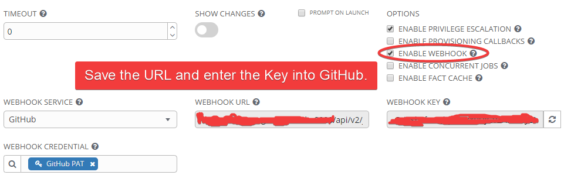
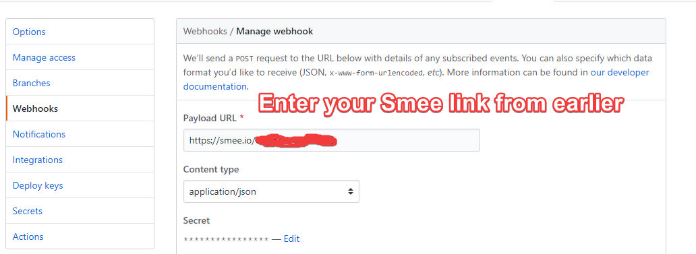

# SmeeAndAWX
A short guide on how to get AWX webhooks behind a firewall with Smee.

tl;dr Get Smee channel link, install smee, have ansible git repo POST to smee, run smee

## The Scenario
As a new AWX user, I was excited to dive into basic CI/CD capabilites. It's all the rage and makes you seem cool. My goal was to get an AWX (poor man's Ansible Tower) job to run after a Git push, to our private Ansible GitHub repository.

But, I really didn't want to open our AWX instance to the outside world. I could have whitelisted Github's IPs, but firewalls are another department and I didn't want to bother them yet.

In comes [Smee](https://smee.io/). An OSS project by GitHub to help get webhooks behind your firewall.

Smee connects to a channel URL (smee.io/stuff), waits for a POST/GitHub webhook action, then forwards that your local AWX instance (e.g https://awxserver.myorg.com:8000/api/v2/job_templates/23/github/).

## Using Smee

First, go to https://smee.io/, and click "New Channel". Save that Smee URL. Install the `smee-client` with `sudo npm -g install smee-client`.

**Note:** I really don't like using node modules on servers, but what can you do?

Go to AWX/Ansible Tower. Find your job template you'd like to run on a git push (e.g dev run). Click "Enable Webhook."



Head to GitHub, go to your repository, and select Settings -> Webhooks. Enter in your Smee URL, that acts as a proxy for your firewall'd AWX payload URL.



To test, run the `smee-client` with:

`sudo smee -t https://awxserver.myorg.com:8000/api/v2/job_templates/23/github/ --path /github-webhook/ --url https://smee.io/mySMEElink`

Note that the `awxserver.myorg` link came from AWX itself after clicking "Enable Webhook".

While that is running, perform a `git push` on the repository, and `smee-client` should report a HTTP 202 from stdout of the `smee-client` if everything went well. Then, the playbook should run.


## Systemd Service
I wanted Smee to run constantly, so here's a small systemd service to allow that.

```
[Unit]
Description=Smee Service
#path should be /etc/systemd/system/smee.service

[Service]
ExecStart=/etc/ansible/smee/smee.sh
#ExecStop=pkill smee

[Install]
WantedBy=multi-user.target
```

and `/etc/ansible/smee/smee.sh` is one line:

```
#!/bin/bash
sudo smee -t https://awxserver.myorg.com:8000/api/v2/job_templates/23/github/ --path /github-webhook/ --url https://smee.io/mySMEElink
```

Then the usual,
```
sudo mv smee.service /etc/systemd/system/
sudo systemctl daemon-reload
sudo systemctl start smee.service
sudo systemctl enable smee.service
sudo systemctl status smee.service
```

## Concerns
I'm not sure how long my Smee URL will last. Is it permanent? Who's to say. This can be scaled up by adding more Smee instances in the script, I think.

